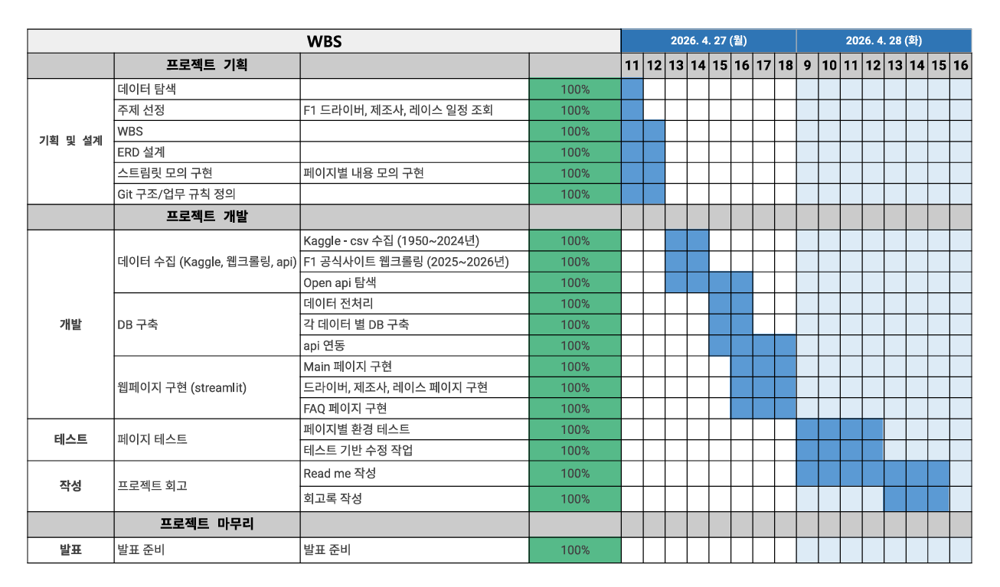

<h1 align='center' style='font-weight: bold;'> 🏎️ F1 Dashboard </h1>

>**목차**
>
> 1. [팀 소개](#-팀-소개)
> 2. [프로젝트 개요](#프로젝트-개요)
> 3. [기술 스택](#️-기술-스택)
> 4. [WBS](#wbs)
> 5. [요구사항 명세서](#요구사항-명세서)
> 6. [ERD](#erd)
> 7. [주요 프로시저](#주요-프로시저)
> 8. [수행 결과](#수행-결과)
 
 

## 👥 팀 소개
  

<h3 style='color:white; font-weight: bold;margin:auto;display:block;'> Team F4 </h3>

 

| <h class="gray_text">이재일</h> | <h class="gray_text">김재원</h> | <h class="gray_text">김동민</h> | <h class="gray_text">유진영</h> |
|:-:|:-:|:-:|:-:|
|||||
|[@qufdlfkd88](https://github.com/qufdlfkd88)|[@kimjae9360](https://github.com/kimjae9360)|[@Uranium10](https://github.com/Uranium10)|[@ujneg18-source](https://github.com/ujneg18-source)|
|PM||||

 

##  🚀 프로젝트 개요
 

 

## 🛠️ 기술 스택
 

 

 

## 📊 WBS

 

## 요구사항 명세서

## 📔 ERD

 
<table border="1" width ="500" height="300">
    <tr bgcolor="#343434" color="white">
        <td>테이블</td> <td>설명</td>
    </tr>
    <tr>
        <td>driver_standings</td> 
        <td>설명</td>
    </tr>
    <tr>
        <td>drivers_master</td> 
        <td>설명</td>
    </tr>
    <tr>
        <td>constructors_standing</td> 
        <td>설명</td>
    </tr>
    <tr>
        <td>constructors</td> 
        <td>설명</td>
    </tr>
    <tr>
        <td>circuits</td> 
        <td>설명</td>
    </tr>
    <tr>
        <td>races</td> 
        <td>설명</td>
    </tr>
</table>

 

## 주요 프로시저

## 수행 결과

    🏎️
    

        <h1 style='margin:0; color:white; font-size:32px;'>F1 Dashboard</h1>
    

